# ExpenseTracker
The Expense Tracker project aims to provide users with a convenient way to track their expenses. The project addresses the common problem of individuals and businesses needing to monitor and manage their spending habits. By developing an expense tracking application, users can easily record and analyse their expenses, helping them make informed financial decisions.
## Features
**1) User Registration and Login:** The project implemented a user registration and login system using ASP.NET MVC. Users can create an account with a unique username, password, and email. Password and email validation rules were enforced to ensure security and proper formatting.

**2) Expense Tracking and Budgeting:** The project provides functionality for users to track their expenses and create custom budgets. Users can enter their expenses, categorize them, and assign them to a specific budget. Budgets can be customized with allocated percentages for different expense categories, allowing users to manage their finances effectively.

**3) User Dashboard:** A user dashboard was developed to provide users with an overview of their financial status. The dashboard displays the user's current budget, remaining budget, budget spent percentage, recent expenses, and a breakdown of expenses by category. It also highlights the top expense day in the last week.

**4) Budget Management:** The project enables users to create, update, and delete budgets. Users can create custom budgets by specifying their monthly income, start date, end date, and allocation percentages for different expense categories. The system validates the allocated percentages to ensure they sum up to 100%. Users can also view and manage their existing budgets, including updating budget details and deleting budgets if needed.

Overall, the project successfully provides users with a personal expense tracking and budgeting solution, helping them monitor their expenses, analyze spending patterns, and stay within their budget limits.
## Screenshots
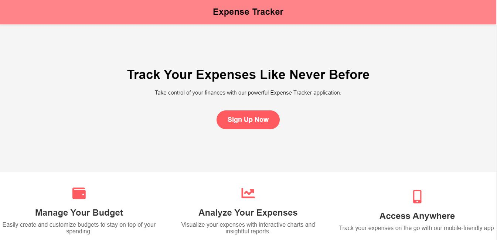
.JPG) 
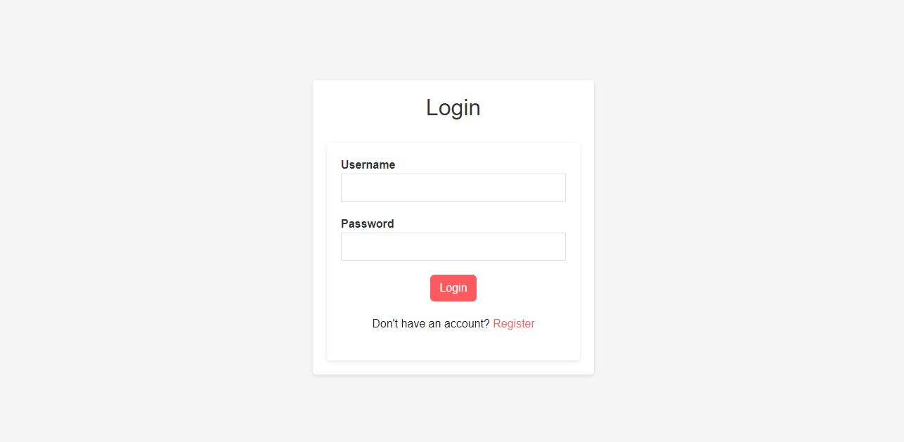 
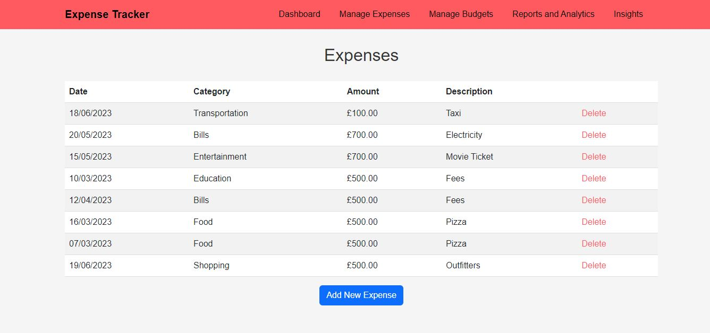 
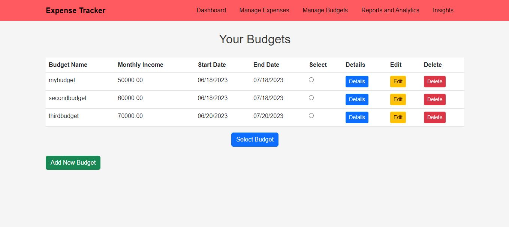 
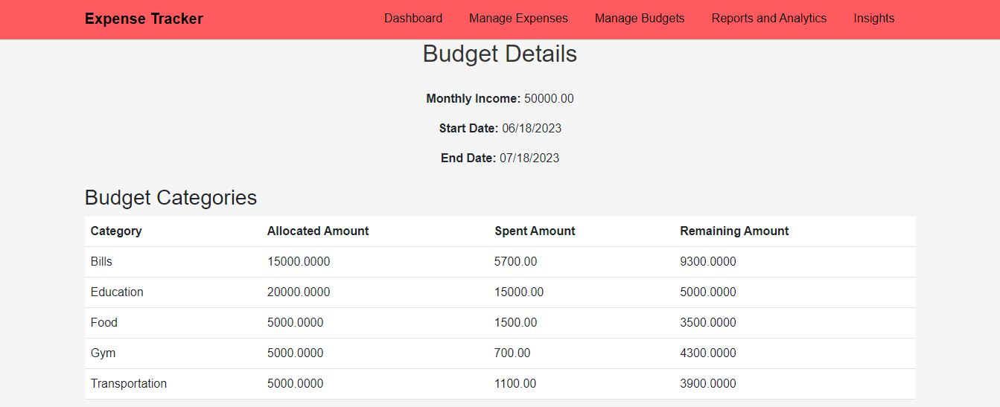 
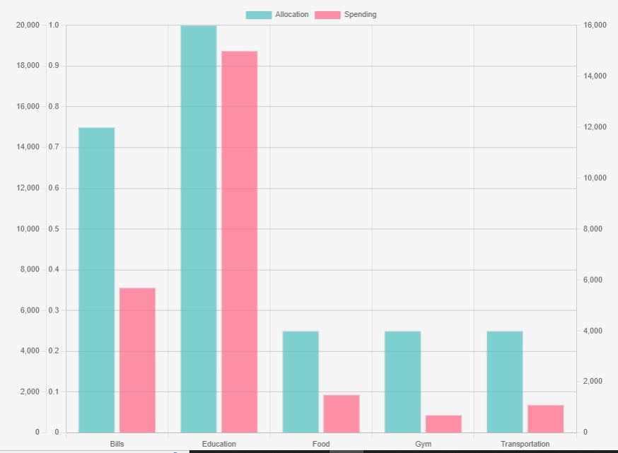 
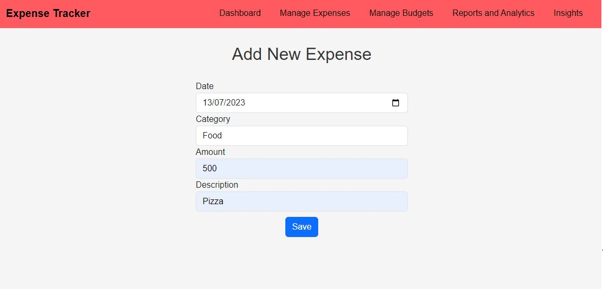 
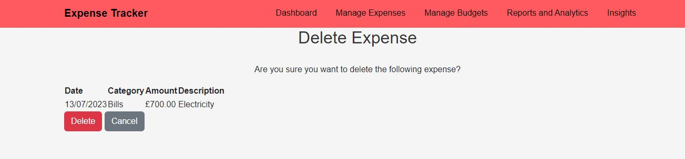 
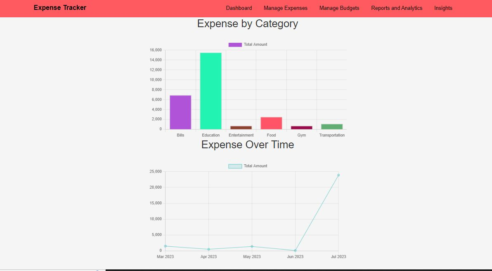 
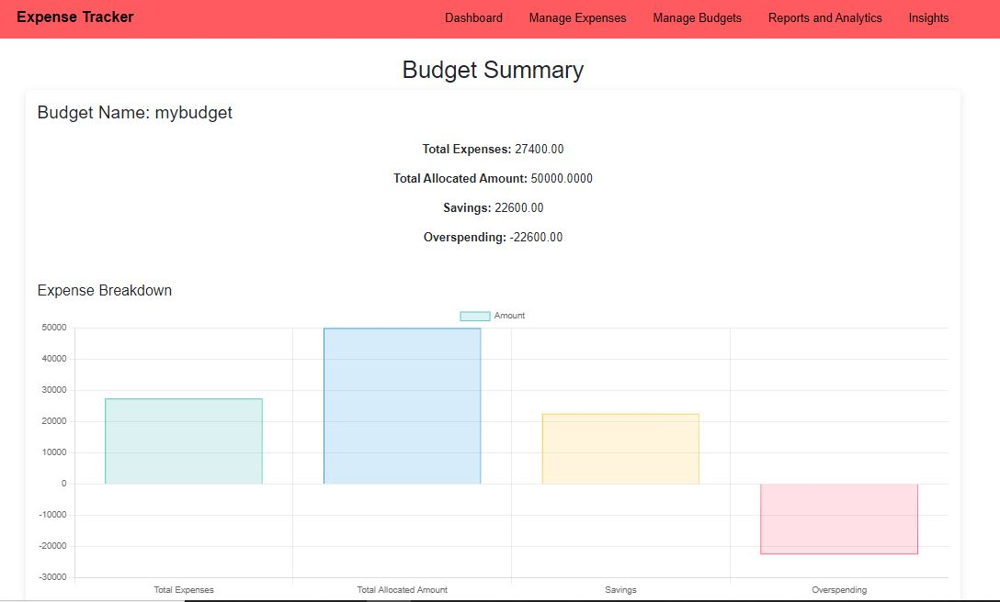 
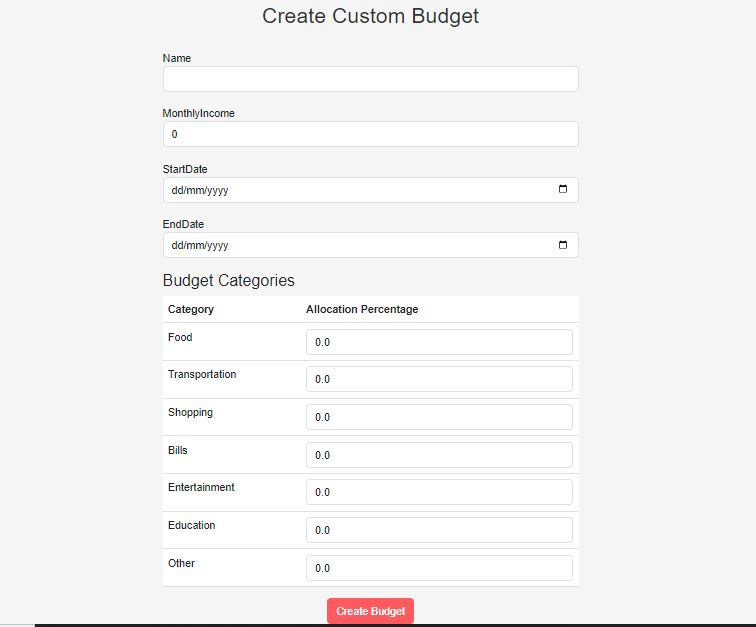 
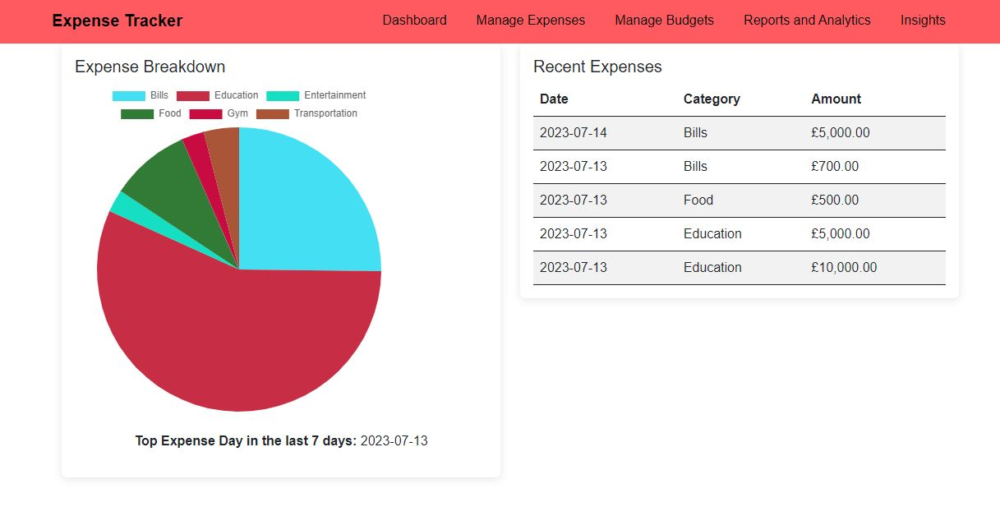 
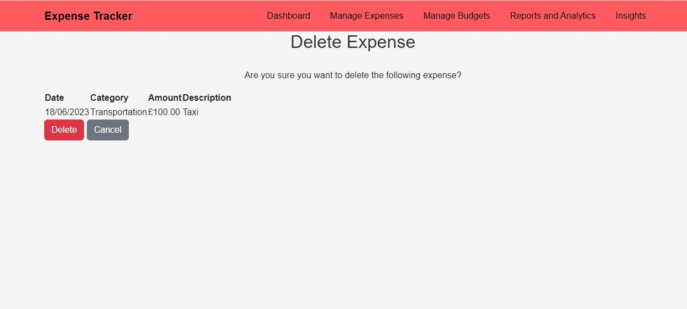 

